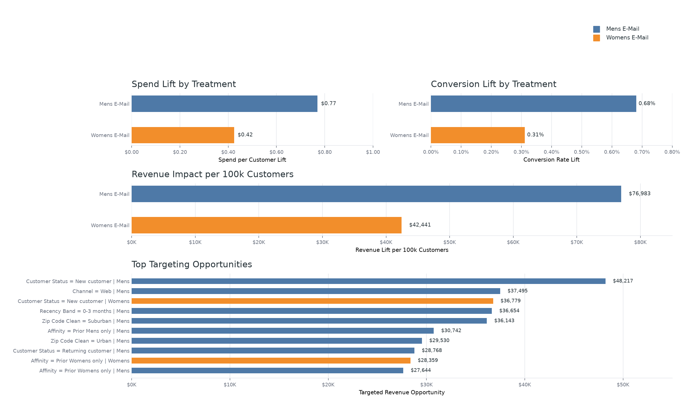

# A/B Testing Case Study: Lifecycle Campaign Impact

This project analyzes a randomized e-mail campaign experiment and translates the results into a business recommendation. The goal is to decide whether a lifecycle campaign should be rolled out, which treatment performs best, and which customer segments offer the strongest revenue opportunity.



## Executive Summary

Mens E-Mail is the strongest treatment. It produced the largest conversion lift, the highest spend lift, and the greatest estimated revenue impact. The recommended path is a staged rollout that starts with high-opportunity customer segments, while continuing to monitor business risk and validate segment-level targeting.

| Treatment | Conversion Lift | Relative Lift | Spend Lift | Estimated Revenue Lift per 100k Customers | Recommendation |
|---|---:|---:|---:|---:|---|
| Mens E-Mail | +0.68 percentage points | +118.8% | +$0.77/customer | +$76,983 | Prioritize for staged rollout |
| Womens E-Mail | +0.31 percentage points | +54.3% | +$0.42/customer | +$42,441 | Use selectively / follow-up targeting |

Both treatments improved conversion versus the control group, but Mens E-Mail created the stronger business case.

## Business Question

Should the company send a lifecycle campaign to customers, and should the campaign be rolled out broadly or targeted to specific segments?

The analysis evaluates:

- conversion lift
- spend per customer lift
- estimated incremental revenue
- statistical significance
- customer segment opportunity
- rollout risks and caveats

## Recommendation

Prioritize Mens E-Mail for rollout analysis, starting with the segments that show the highest estimated opportunity:

1. New customers
2. Web-channel customers
3. Recent customers
4. Prior Mens-only customers
5. High-performing geography and history segments

Womens E-Mail should not be ignored, but the evidence supports a more selective approach. It may be useful for customers with prior Womens affinity, and it would be a good candidate for a follow-up personalization test.

## Methodology

The source dataset contains 64,000 customers randomly assigned to one of three groups: `No E-Mail`, `Mens E-Mail`, or `Womens E-Mail`. The data audit checks missing values, category consistency, assignment counts, and pre-treatment balance before the experiment analysis begins.

The primary outcome is conversion rate. Secondary outcomes include visit rate, spend per customer, and estimated incremental revenue. Conversion and visit outcomes are tested with two-proportion z-tests. Spend per customer is evaluated with bootstrap confidence intervals because spend is zero-inflated and skewed.

Segment analysis is exploratory. It helps identify promising targeting opportunities, but the overall randomized experiment remains the strongest evidence for whether the campaign worked.

## Deliverables

| Deliverable | Location |
|---|---|
| Final decision memo | [`reports/decision_memo.md`](reports/decision_memo.md) |
| Tableau dashboard workbook | [`tableau/ab_testing_campaign_dashboard.twbx`](tableau/ab_testing_campaign_dashboard.twbx) |
| Tableau build guide and CSV extracts | [`tableau/`](tableau/) |
| Final figures | [`reports/figures/`](reports/figures/) |
| Experiment design notes | [`docs/experiment_design.md`](docs/experiment_design.md) |
| Data dictionary | [`docs/data_dictionary.md`](docs/data_dictionary.md) |

## Analysis Notebooks

| Notebook | Purpose |
|---|---|
| [`01_data_audit.ipynb`](notebooks/01_data_audit.ipynb) | Validate the raw dataset, check missing values, document category issues, and confirm randomization balance. |
| [`02_experiment_analysis.ipynb`](notebooks/02_experiment_analysis.ipynb) | Run the formal A/B test: group metrics, lift, confidence intervals, p-values, and revenue impact. |
| [`03_segment_uplift_analysis.ipynb`](notebooks/03_segment_uplift_analysis.ipynb) | Explore how treatment effects differ across customer segments and identify targeting opportunities. |
| [`04_decision_memo_figures.ipynb`](notebooks/04_decision_memo_figures.ipynb) | Create final report figures and recommendation summary tables. |

## Repository Structure

```text
ab-testing/
  data/
    raw/          Original downloaded dataset
    interim/      Cleaned working files, ignored by Git
    processed/    Generated analysis outputs, ignored by Git
  docs/           Experiment design, data dictionary, and setup notes
  notebooks/      Analysis notebooks
  reports/        Final memo and figures
  sql/            Optional SQL analysis starter
  src/            Reusable Python helper functions
  tableau/        Tableau workbook, guide, and dashboard data extracts
```

## Data Source

The dataset comes from the MineThatData E-Mail Analytics challenge, a public retail marketing experiment with a control group and two treatment groups.

- Dataset description: https://blog.minethatdata.com/2008/03/minethatdata-e-mail-analytics-and-data.html
- CSV source: http://www.minethatdata.com/Kevin_Hillstrom_MineThatData_E-MailAnalytics_DataMiningChallenge_2008.03.20.csv

## Reproduce the Analysis

Create and activate a virtual environment:

```powershell
python -m venv .venv
.\.venv\Scripts\Activate.ps1
.\.venv\Scripts\python.exe -m pip install -r requirements.txt
```

Start JupyterLab:

```powershell
.\scripts\start_jupyter.ps1
```

Run an individual notebook:

```powershell
.\scripts\execute_notebook.ps1 notebooks\02_experiment_analysis.ipynb
```

The startup script registers a local Jupyter kernel named `Python (ab-testing)`. Additional setup notes are available in [`docs/setup_jupyter.md`](docs/setup_jupyter.md).

## Tools

Python, pandas, NumPy, SciPy, Matplotlib, Jupyter Notebook, Tableau, Git, and GitHub.