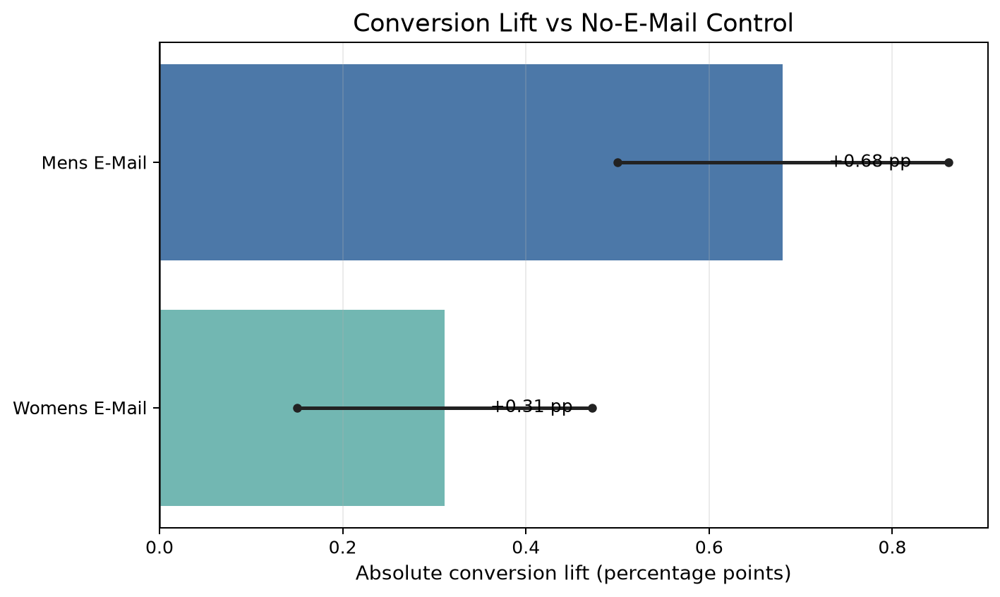
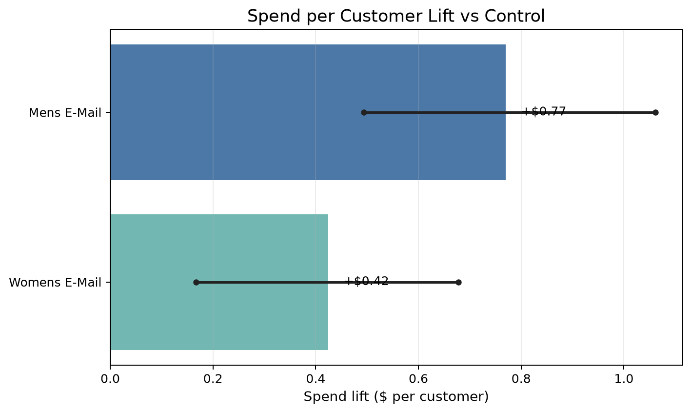
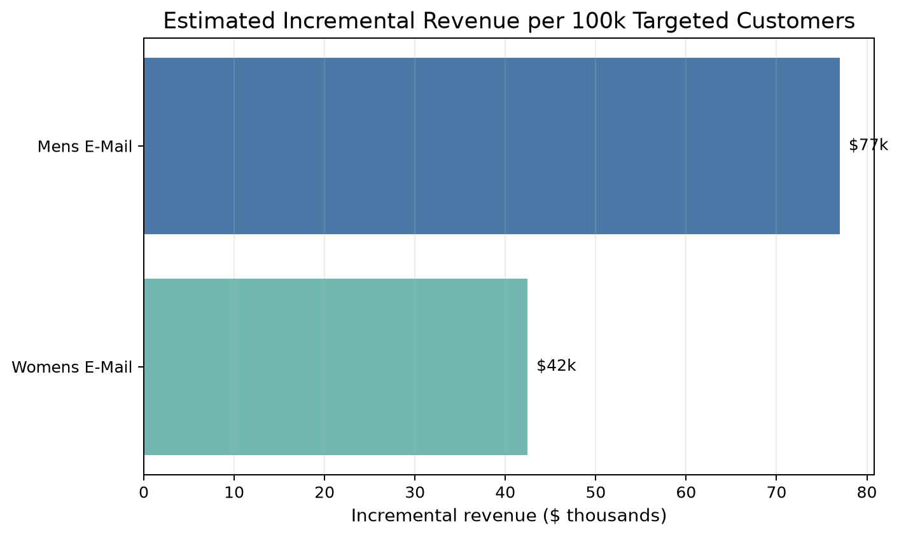
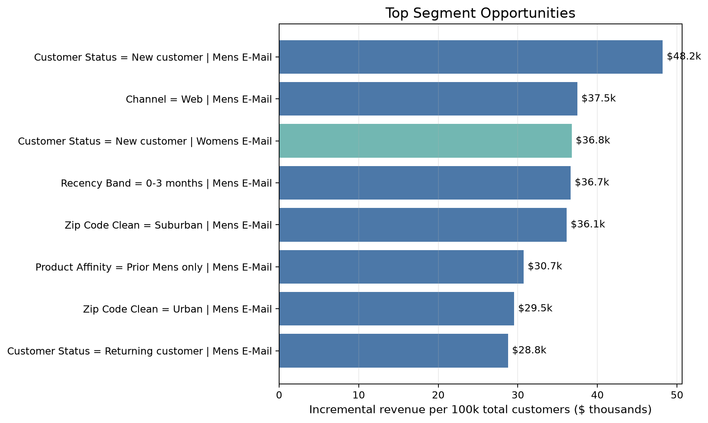

# Decision Memo: Lifecycle Campaign A/B Test

## Recommendation

Prioritize **Mens E-Mail** for rollout, with a staged targeting strategy focused on the strongest customer segments. Mens E-Mail produced the largest overall lift in conversion and spend per customer, and it also appeared as the best-performing treatment across most stable segment categories.

I would not recommend a blind full rollout without monitoring. The next step should be a targeted rollout to high-opportunity segments, paired with tracking for margin, unsubscribe behavior, customer complaints, and longer-term repeat purchase.

## Executive Summary

The experiment compared two email treatments against a randomized no-email control group. Both treatments outperformed the control, but Mens E-Mail was clearly stronger.

Mens E-Mail increased conversion from **0.57%** to **1.25%**, a lift of **0.68 percentage points** or **118.8% relative to control**. It also increased spend per customer by **$0.77**, which translates to an estimated **$76,983 in incremental revenue per 100,000 targeted customers**.

Womens E-Mail also improved performance, but with a smaller effect: conversion increased from **0.57%** to **0.88%**, and spend per customer increased by **$0.42**, equal to about **$42,441 in incremental revenue per 100,000 targeted customers**.

## Business Context

The original dataset comes from the MineThatData E-Mail Analytics challenge, a retail email campaign experiment. For this portfolio case study, I frame the analysis as a lifecycle campaign decision similar to what a SaaS or product analytics team might face: should the company send a nurture campaign to users, and should that campaign be broadly rolled out or targeted?

The source data is not literally SaaS trial data, so the final recommendation is about experiment design and business decision-making rather than a claim about a real SaaS product.

## Experiment Design

Customers were randomly assigned to one of three groups:

- `No E-Mail`: control group
- `Mens E-Mail`: treatment group A
- `Womens E-Mail`: treatment group B

The analysis uses conversion rate as the primary metric. Visit rate and spend per customer are secondary metrics. Spend per customer is especially important because it converts the experiment result into business impact.

The data audit confirmed that the dataset contains **64,000 customers**, no missing values, balanced experiment groups, and strong pre-treatment balance across key customer characteristics.

## Primary Result

Mens E-Mail had the strongest conversion result. Compared with the no-email control, it increased conversion by **0.68 percentage points**. Womens E-Mail also increased conversion, but by a smaller **0.31 percentage points**.

The confidence intervals for both treatments are above zero, which supports the conclusion that both email campaigns improved conversion compared with the control group.

## Revenue Impact

Mens E-Mail increased spend per customer by **$0.77** compared with the control group. Womens E-Mail increased spend per customer by **$0.42**.

Projected to 100,000 targeted customers, the estimated incremental revenue is:

| Treatment | Estimated Incremental Revenue per 100k Customers |
|---|---:|
| Mens E-Mail | $76,983 |
| Womens E-Mail | $42,441 |

This makes Mens E-Mail the stronger business choice, not just the stronger statistical result.

## Segment Insights

The segment analysis suggests that Mens E-Mail is not only the best overall treatment, but also the strongest option across most stable customer segments.

Top opportunities include:

| Segment | Best Treatment | Spend Lift per Customer |
|---|---|---:|
| New customers | Mens E-Mail | $0.96 |
| Web channel customers | Mens E-Mail | $0.85 |
| Recent customers, 0-3 months | Mens E-Mail | $1.05 |
| Suburban customers | Mens E-Mail | $0.80 |
| Prior Mens only customers | Mens E-Mail | $0.68 |

Across stable segment categories, Mens E-Mail appeared as the best treatment **17 times**, while Womens E-Mail appeared as the best treatment **4 times**.

Womens E-Mail still has useful pockets, especially among customers with prior Womens activity, but the evidence does not support making it the primary rollout campaign.

## Risks and Caveats

This segment analysis is exploratory. Because many subgroups are reviewed, some segment-level results may look strong by chance. I use the segment results to guide targeting and follow-up tests, not to replace the overall randomized experiment result.

Other caveats:

- The dataset is from retail email marketing, not a literal SaaS free-trial test.
- The outcome window is short, so the analysis does not measure long-term retention or repeat purchase.
- The dataset does not include campaign cost, margin, unsubscribe rate, or customer satisfaction.
- Revenue impact is based on spend, not profit.
- A final business decision should include operational costs and customer experience guardrails.

## Final Decision

I recommend prioritizing **Mens E-Mail** for rollout because it delivers the strongest conversion lift, the highest spend lift, and the largest estimated revenue impact.

The best rollout path is targeted rather than fully broad at first:

1. Start with high-opportunity segments such as new customers, web-channel customers, recent customers, and prior Mens-only customers.
2. Monitor conversion, revenue, unsubscribe behavior, support complaints, and repeat purchase.
3. Use Womens E-Mail selectively for segments where it appears more relevant, especially prior Womens-affinity customers.
4. Run a follow-up targeting test to confirm whether segmented messaging outperforms a broad Mens E-Mail rollout.

## Next Test

The next experiment should compare:

- broad Mens E-Mail rollout
- targeted Mens E-Mail rollout
- personalized campaign based on prior product affinity
- no-email holdout

The primary metric should remain conversion or revenue per customer, but the test should add guardrail metrics such as unsubscribe rate, complaint rate, and longer-term repeat purchase.